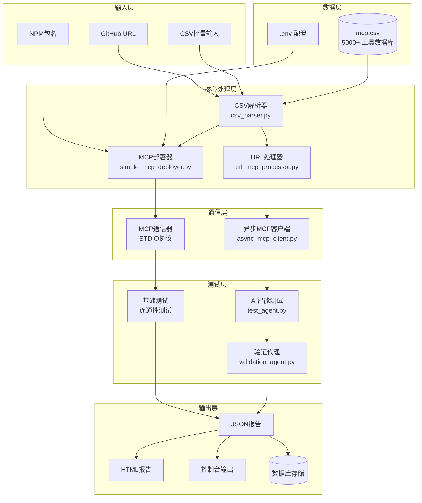
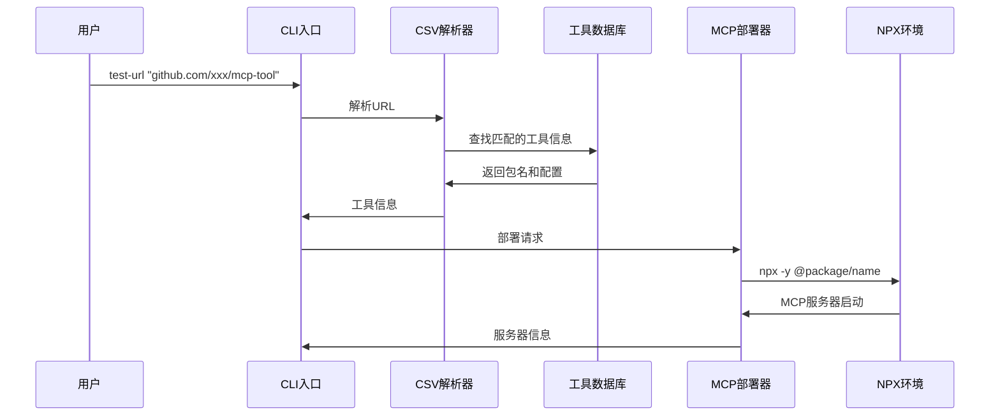
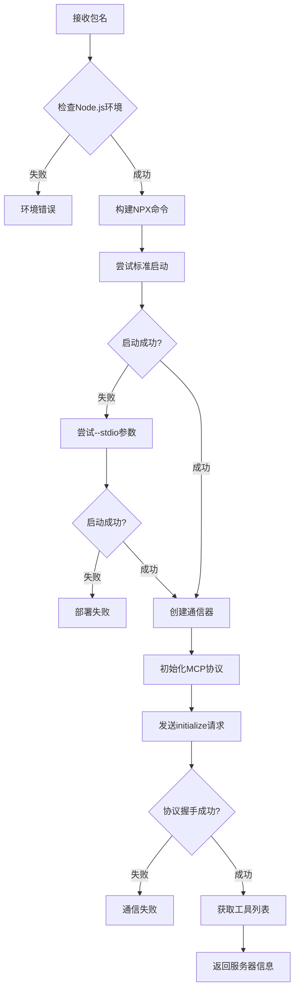
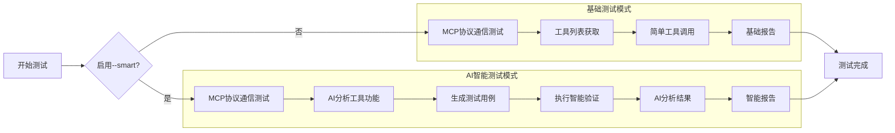
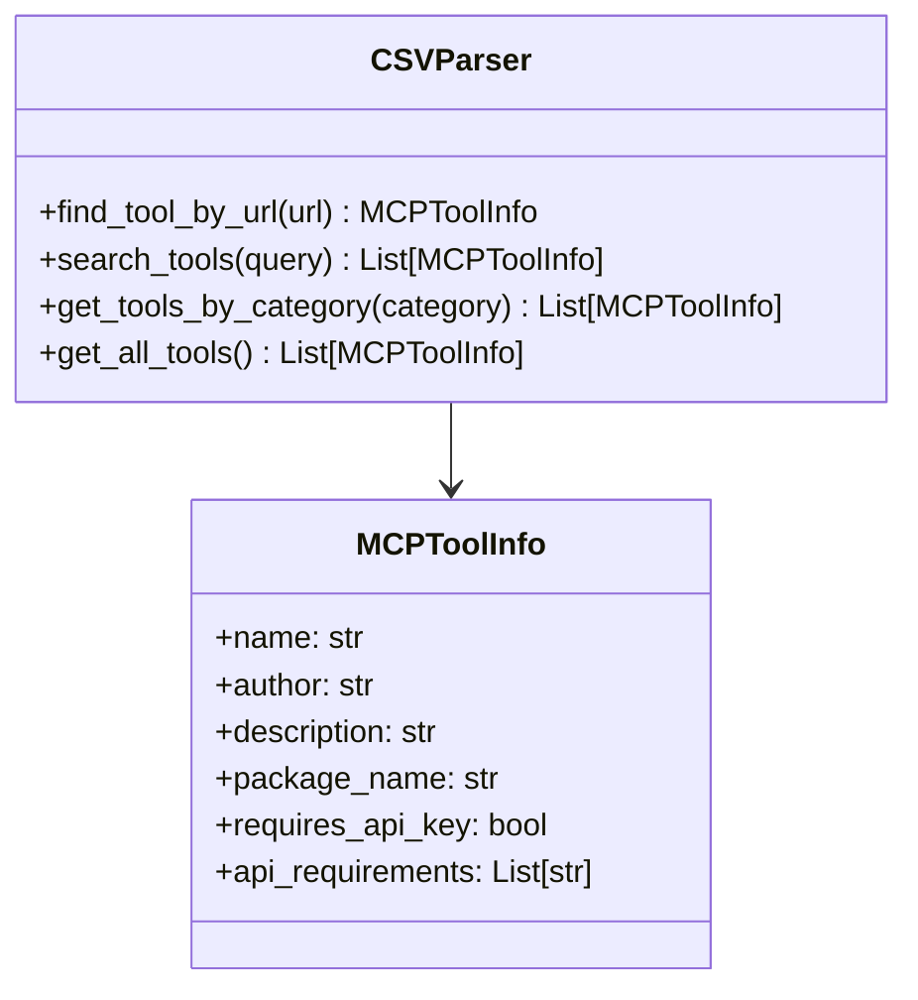
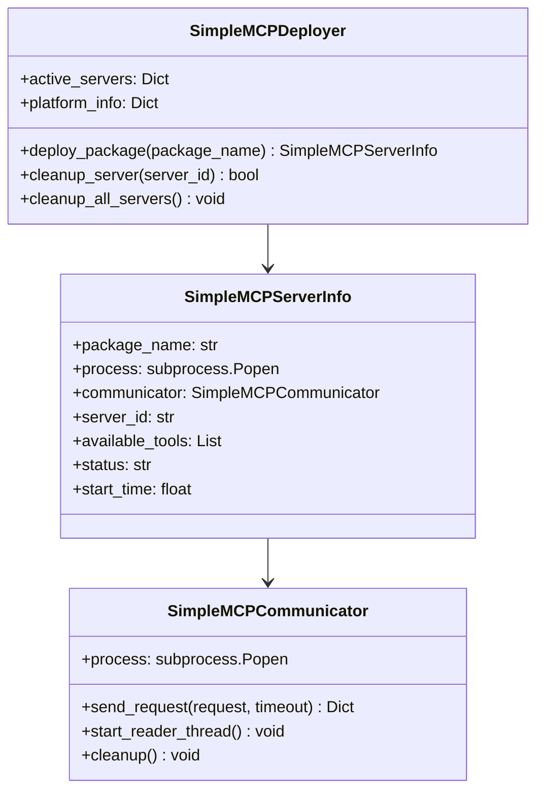
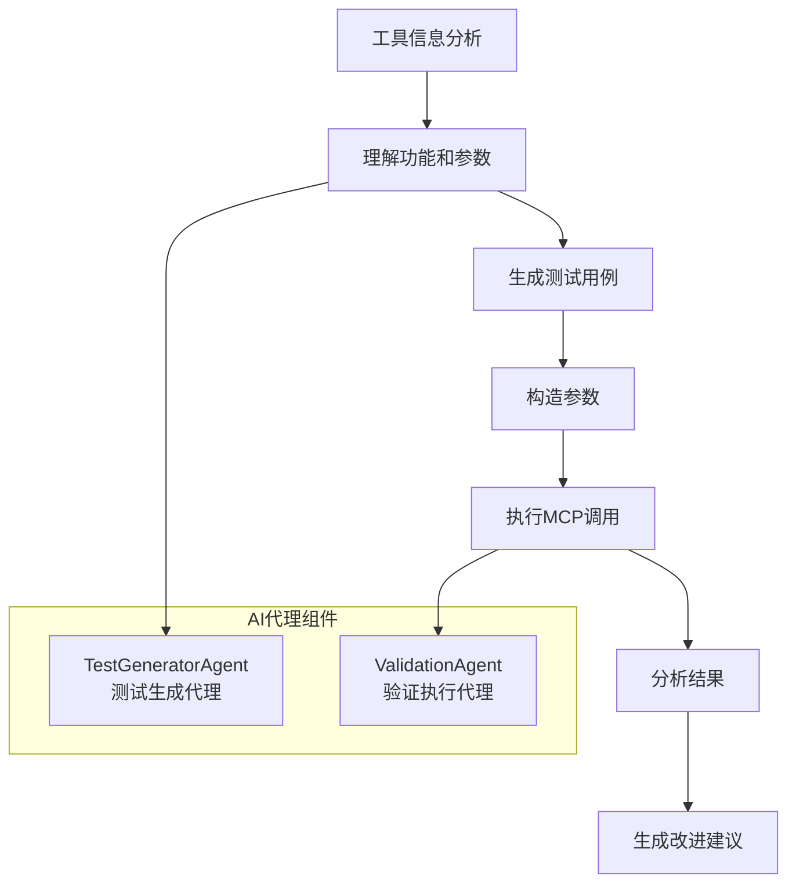
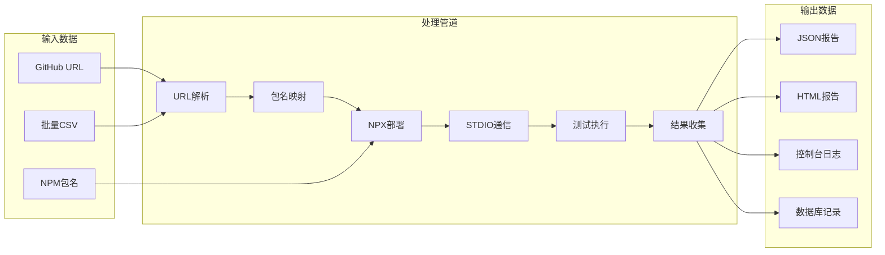

# 🔧 MCP Testing Framework - 架构与工作流程

## 项目概述

Batch MCP Testing Framework 是一个自动化的 MCP (Model Context Protocol) 工具测试框架，通过 URL 驱动的方式实现 MCP 工具的动态部署、智能测试和详细报告生成。

## 🏗️ 系统架构



## 🔄 核心工作流程

### 1. URL处理流程



### 2. MCP部署和通信流程



### 3. 测试执行流程



## 🧩 核心组件详解

### 1. CSV解析器 (csv_parser.py)

**职责**: 管理5000+工具的数据库，提供URL到包名的映射



### 2. MCP部署器 (simple_mcp_deployer.py)

**职责**: 动态部署和管理MCP服务器进程



### 3. AI智能测试代理

**职责**: 使用大模型生成和执行智能测试用例



## 📊 数据流图



## 🔧 关键技术实现

### 1. 跨平台STDIO通信

```python
# 核心通信逻辑
def send_request(self, request, timeout=30):
    """发送MCP请求并等待响应"""
    with self.lock:
        # 构造JSON-RPC请求
        json_request = json.dumps(request) + '\n'
        
        # 发送到MCP服务器stdin
        self.process.stdin.write(json_request.encode())
        self.process.stdin.flush()
        
        # 等待响应
        try:
            response = self.response_queue.get(timeout=timeout)
            return {'success': True, 'data': json.loads(response)}
        except queue.Empty:
            return {'success': False, 'error': '请求超时'}
```

### 2. 自适应部署策略

```python
def _try_start_process(self, cmd, creation_flags, display_name, run_command, package_name):
    """尝试启动进程，带--stdio回退机制"""
    
    # 第一次尝试：标准启动
    try:
        process = subprocess.Popen(cmd, ...)
        if self._test_process_health(process):
            return process
    except:
        pass
    
    # 第二次尝试：添加--stdio参数
    cmd_with_stdio = cmd + ['--stdio']
    try:
        process = subprocess.Popen(cmd_with_stdio, ...)
        if self._test_process_health(process):
            return process
    except:
        pass
        
    return None
```

### 3. AI测试用例生成

```python
async def generate_test_cases(self, tool_info: MCPToolInfo, available_tools: List):
    """使用AI生成针对性测试用例"""
    
    # 分析工具功能
    analysis_prompt = f"""
    分析MCP工具: {tool_info.name}
    可用工具: {available_tools}
    生成3-5个测试用例，包括：
    1. 基础功能测试
    2. 边界条件测试  
    3. 错误处理测试
    """
    
    # 调用AI模型生成
    response = await self.ai_model.generate(analysis_prompt)
    
    # 解析为结构化测试用例
    return self._parse_test_cases(response)
```

## 📈 性能优化策略

### 1. 并发处理
- 使用异步I/O处理MCP通信
- 批量测试支持限流控制
- 智能超时和重试机制

### 2. 资源管理
- 自动清理MCP服务器进程
- 内存使用监控和限制
- 磁盘空间管理

### 3. 错误恢复
- 多级回退策略
- 详细错误诊断
- 自动恢复建议

## 🎯 扩展性设计

### 1. 插件架构
- 支持自定义测试代理
- 可扩展报告格式
- 模块化组件设计

### 2. 配置驱动
- 环境变量配置
- YAML/JSON配置文件
- 运行时参数调整

### 3. 集成能力
- GitHub Actions支持
- CI/CD管道集成
- API接口提供

---

**这个架构确保了框架的可靠性、扩展性和易用性，为MCP生态系统提供了强大的测试基础设施。** 🔧✨
